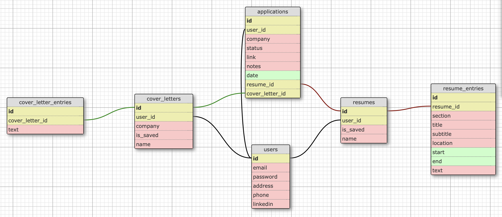

<h1>– Project Description –</h1>

Profiler is a technical project created in the "Skills: Programming – Introduction Level" course at HSG University, utilizing Ruby on Rails. It's a web application designed for managing CVs, Cover Letters, and job applications, showcasing several key aspects of web development.

The application implements CRUD actions, allowing users to create, read, update, and delete their professional documents. This is a fundamental part of the application's interactivity and data management.

For the backend, Profiler uses PostgreSQL, a robust and scalable open-source relational database. This choice ensures efficient handling and storage of user data, including personal documents and application details. An automated seed file is included to populate the database with initial data, crucial for consistent testing and demonstration purposes.

In terms of architecture, Profiler separates concerns using models and controllers. Models handle the business logic and data interactions, while controllers manage the user interface and application flow, ensuring a clean and maintainable codebase.

A unique feature of Profiler is a download functionality, allowing users to easily download their documents in PDF format. The application also includes date interactions, enabling users to input and manage dates related to their applications.

The front-end of Profiler is marked by the use of shared components, promoting reusability and consistency across the application. HTML and CSS are utilized for structuring and styling the application, with special attention to the home page to enhance user experience.

Overall, Profiler serves as a comprehensive example of web development using Ruby on Rails, covering everything from database management and MVC architecture to user interface design and shared component utilization.

<h1>– How to Use –</h1>

This application has a seed file, which populates the database for you. So please log-in with one of the pre-built accounts:

1. Download as ZIP-File, by clicking on the green button, saying "code", at the top of this page
2. In your Terminal, navigate to the folder "profiler-master"
3. type "rails serve" in your terminal
4. open the local link
5. login with: a@profilertest.com, password: 111111 (or b@.. c@.. d@.. etc., same password)

when running in to issues, run the following commands in your terminal:
1. rails db:drop
2. rails db:create
3. rails db:migrate
4. rails db:seed

<h1>– Database Schema Visualisation –</h1>

<h1>– Our Workflow & Experience –</h1>

We want to share an overview of our team's workflow and learning experience for the Profiler project.

We utilized a single GitHub account for our project, with each team member working on individual branches named after themselves. This approach allowed us to independently focus on different aspects of the project while maintaining a cohesive development process. Regular commits, pulls, and merges were integral to our workflow, ensuring everyone's contributions were synchronized.

In terms of development, our focus was on Ruby, HTML, and CSS, adhering to Object-Oriented Programming principles. Each of us started by developing a specific page (Resume, Cover Letter, Applications, Home Page), with Finn taking the lead in the initial setup and the final stage.

The project was particularly enlightening due to the varied levels of experience within our team. Members with more coding experience shared their knowledge, helping those newer to these languages grasp more complex concepts and apply them practically, such as controllers, models and the MVC-architecture.

On the other hand, experienced team members solidified their knowledge by guiding others, which also highlighted areas for their own improvement. The project emphasized the importance of clear communication, especially when integrating different parts of the application simultaneously.

In conclusion, this project was a great learning experience. It wasn't just about developing a web application, but also about fostering a team environment where each member could contribute, learn, and grow, regardless of their prior experience. This project turned out to be a rewarding journey for all of us, combining coding skills in different languages.

Thank you for visiting Profiler!

Finn S., Luc J., This S. & Patric H.
